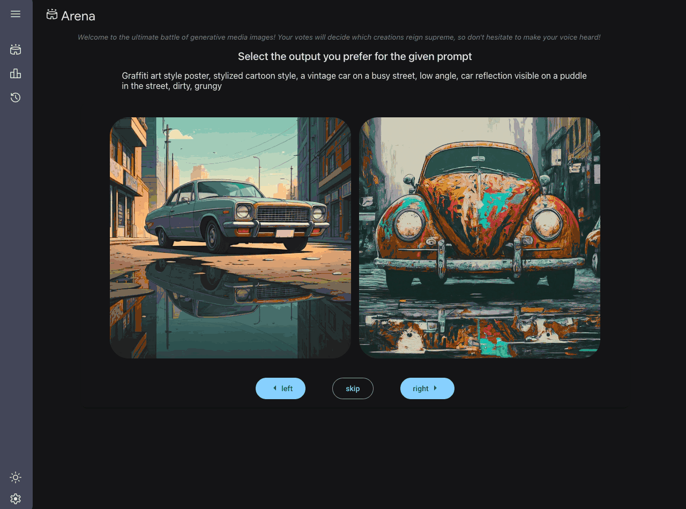

# Image Generation Arena & Leaderboard

This is an example of an arena & leaderboard to compare different image generation tools.

Currently, it uses Imagen 2, Imagen 3, image generation models with Gemini 2.0 experimental's image output model forthcoming.

The application is written in [Mesop](https://google.github.io/mesop/), a python UX framework, with the [Studio Scaffold starter](https://github.com/ghchinoy/studio-scaffold).





## Prerequisites


### Python environment

A python virtual environment, with required packages installed.

Using [uv](https://github.com/astral-sh/uv):

```
# create a virtual environment
uv venv venv
# activate the virtual environ,ent
. venv/bin/activate
# install the requirements
uv pip install -r requirements.txt
```

### Cloud Firestore

Cloud Firestore is used to save generated image metadata and ELO scores for the leaderboard.

* Create a collection called `arena_images` 
* Create a collection called `arena_elo`; this collection will require an index (type asc, timestamp desc)

These can be changed this via .env var `IMAGE_COLLECTION_NAME` and `IMAGE_RATINGS_COLLECTION_NAME`, respectively; see below.

To create an index via the firebase command line tools:

```
firebase firestore:indexes arena_elo \
  --field=type,ASCENDING \
  --field=timestamp,DESCENDING \
  --query-scope=COLLECTION_GROUP
```


### Application environment vars

Images are generated and stored in a Google Cloud Storage bucket.

Enter these into a new file named `.env`

```
PROJECT_ID=YOUR_PROJECT_ID  # from $(gcloud config get project)
# LOCATION=us-central1  # defaults to "us-central1"
MODEL_ID=gemini-2.0-flash-exp
GENMEDIA_BUCKET=YOUR_MEDIA_BUCKET # like: ${PROJECT_ID}-genmedia
# IMAGE_COLLECTION_NAME=arena_images  # defaults to "arena_images"
# IMAGE_RATINGS_COLLECTION_NAME=arena_elo # defaults to "arena_elo"
# ELO_K_FACTOR=32 # defaults to 32
```


## Arena app

Start the app to explore

```
mesop main.py
```


## Deploy


### Service Account
Create a Service Account to run your service, and provide the following permissions to the Service Account

* Cloud Run Invoker
* Vertex AI User
* Cloud Datastore User
* Storage Object User

```
export PROJECT_ID=$(gcloud info --format='value(config.project)')

export DESC="genmedia arena"
export SA_NAME="sa-genmedia-arena"
export SA_ID=${SA_NAME}@${PROJECT_ID}.iam.gserviceaccount.com

# create a service account
gcloud iam service-accounts create $SA_NAME --description $DESC --display-name $SA_NAME

# assign vertex and cloud run roles
gcloud projects add-iam-policy-binding $PROJECT_ID --member="serviceAccount:${SA_ID}" --role "roles/run.invoker"
gcloud projects add-iam-policy-binding $PROJECT_ID --member="serviceAccount:${SA_ID}" --role "roles/aiplatform.user"
gcloud projects add-iam-policy-binding $PROJECT_ID --member="serviceAccount:${SA_ID}" --role "roles/storage.objectUser"
gcloud projects add-iam-policy-binding $PROJECT_ID --member="serviceAccount:${SA_ID}" --role "roles/datastore.user"
```

### Deploy

```
gcloud run deploy genmedia-arena --source . \
    --service-account=$SA_ID \
    --set-env-vars GENMEDIA_BUCKET=${PROJECT_ID}-genmedia \
    --set-env-vars PROJECT_ID=${PROJECT_ID} \
    --set-env-vars MODEL_ID=gemini-2.0-flash-exp \
    --region us-central1
```

## Application Code Layout & Extending the App 

The Arena application is an example of the Studio Scaffold. This includes the following components:

Mesop Application modules

* main.py - Mesop application main entry point
* Components - Mesop UX components used in the Mesop application
* Pages - Mesop UX Pages
* State - Mesop State management
* Config - Application and service configuration parameters

Common Cloud and Generative AI Modules

* Common - modules for interacting with Cloud services, sucn as Firestore, Storage
* Models - Generative AI model modules


### Extending the UX

To extend the UX, for example, by adding pages - you'll add a Page, using UX components in Components, and then modify the components/side_nav.py to reference the Page for access in the navigation.

### Extending the Model Capabilities

To extend the model usage, for example adding in a Model Garden model such as [FLUX.1](https://console.cloud.google.com/vertex-ai/publishers/black-forest-labs/model-garden/flux1-schnell) - add the implementation of FLUX.1 image generation to the Models module, and then modify the UX to invoke that model in the `pages/arena.py` Page. This may also require adding in any explicit configurations to the Config module, `config/default.py`.

Follow [Model Garden](https://cloud.google.com/vertex-ai/generative-ai/docs/model-garden/explore-models) instructions on how to deploy [FLUX.1](https://console.cloud.google.com/vertex-ai/publishers/black-forest-labs/model-garden/flux1-schnell). 


# Disclaimer

This is not an official Google project
