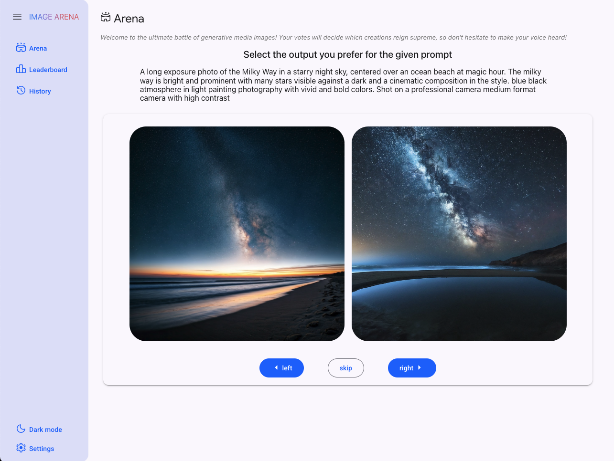

# Image Generation Arena & Leaderboard

This is an example of an arena & leaderboard to compare different image generation tools.

Currently, it uses Imagen 2, Imagen 3, and Gemini 2.0 experimental's image generation models.

The application is written in [Mesop](https://google.github.io/mesop/), a python UX framework, with the [Studio Scaffold starter](https://github.com/ghchinoy/studio-scaffold).





## Prerequisites


### Python environment

A python virtual environment, with required packages installed.

Using [uv](https://github.com/astral-sh/uv):

```
# create a virtual environment
uv venv venv
# activate the virtual environ,ent
. venv/bin/activate
# install the requirements
uv pip install -r requirements.txt
```

### Cloud Firestore

Cloud Firestore is used to save generated image metadata and ELO scores for the leaderboard.

* Create a collection called `arena_images` 
* Create a collection called `arena_elo` 

These can be changed this via .env var `IMAGE_COLLECTION_NAME` and `IMAGE_RATINGS_COLLECTION_NAME`, respectively; see below.


### Application environment vars

Images are generated and stored in a Google Cloud Storage bucket.

Enter these into a new file named `.env`

```
PROJECT_ID=YOUR_PROJECT_ID  # from $(gcloud config get project)
# LOCATION=us-central1  # defaults to "us-central1"
MODEL_ID=gemini-2.0-flash-exp
GENMEDIA_BUCKET=YOUR_MEDIA_BUCKET # like: ${PROJECT_ID}-genmedia
# IMAGE_COLLECTION_NAME=arena_images  # defaults to "arena_images"
# IMAGE_RATINGS_COLLECTION_NAME=arena_elo # defaults to "arena_elo"
# ELO_K_FACTOR=32 # defaults to 32
```


## Arena app

Start the app to explore

```
mesop main.py
```

# Disclaimer

This is not an official Google project
